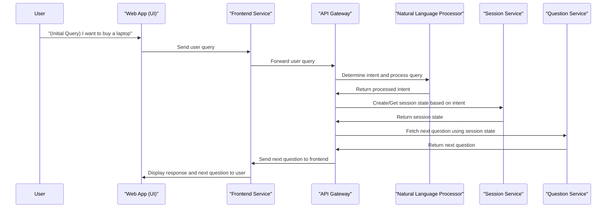
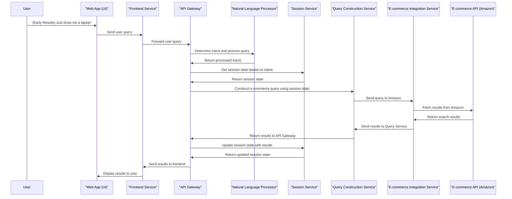
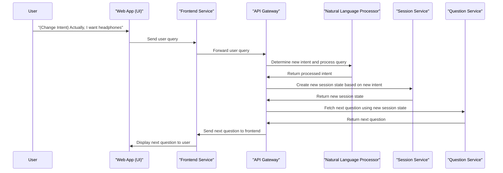
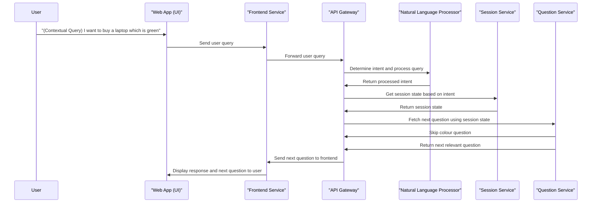
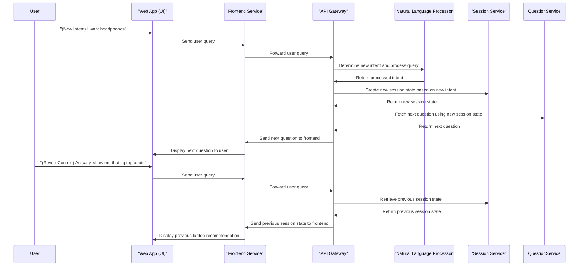
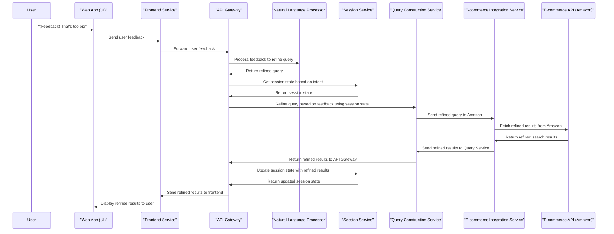
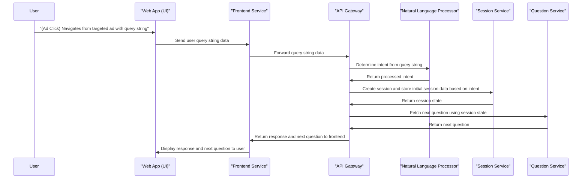

# Architecture

## Service Overview
1. **API Gateway**: Central routing layer for all incoming requests.
2. **Natural Language Processor**: Processes natural language queries and determines user intent.
3. **Session Service**: Manages session state, including creation, retrieval, and updates.
4. **Question Service**: Manages dynamic question flow during the Q&A process.
5. **Query Construction Service**: Constructs e-commerce queries based on user inputs.
6. **E-commerce Integration Service**: Interfaces with external e-commerce APIs to fetch product data.

## Detailed Service Responsibilities and Usage
### 1. API Gateway (Azure API Management)
- **Responsibilities**: 
  - Acts as the central routing layer for all incoming requests.
  - Forwards requests to appropriate backend services (Natural Language Processor, Session Service, Question Service, Query Construction Service, E-commerce Integration Service).
  - Returns responses from backend services to the frontend.
- **Usage**:
  - Receives all user queries and interactions from the frontend.
  - **Does not maintain any state or session information.**
  - Purely routes requests and responses between the frontend and backend services.

### 2. Natural Language Processor (Azure OpenAI)
- **Responsibilities**:
  - Processes natural language queries to determine user intent.
  - Provides refined queries based on user feedback.
  - Returns the intent and any necessary processing results.
- **Usage**:
  - Called to process user queries and determine intent.
  - Processes feedback to refine search queries.
  - Does not manage session data but utilizes session information for context if provided.

### 3. Session Service (Azure Cosmos DB or Azure Functions)
- **Responsibilities**:
  - Manages session state, including creation, retrieval, and updating of session data.
  - Stores the session data, including session ID and relevant contextual information.
- **Usage**:
  - Called to create, get, and update session states based on user interactions.
  - Stores and retrieves session data to maintain context across interactions.
  - Returns session state information to the API Gateway for further routing to other services.

### 4. Question Service (Azure Functions)
- **Responsibilities**:
  - Manages the dynamic question flow during the Q&A process.
  - Determines the next relevant question to ask based on the session state.
  - Skips irrelevant questions based on initial user inputs and context.
- **Usage**:
  - Called to fetch the next question in the Q&A process.
  - Uses session state information to determine the next question.
  - Provides the next question to the API Gateway to be sent to the frontend.

### 5. Query Construction Service (Azure Functions)
- **Responsibilities**:
  - Constructs e-commerce queries based on user inputs and session state.
  - Refines queries based on user feedback and additional information.
- **Usage**:
  - Called to construct queries for e-commerce searches.
  - Utilizes session state information to create accurate and context-aware queries.
  - Sends constructed queries to the E-commerce Integration Service for execution.

### 6. E-commerce Integration Service (Azure Functions)
- **Responsibilities**:
  - Interfaces with external e-commerce APIs (e.g., Amazon) to fetch product data.
  - Handles the execution of search queries and retrieval of search results.
- **Usage**:
  - Called to send queries to e-commerce platforms.
  - Fetches and returns search results from e-commerce APIs.
  - Sends the search results back to the Query Construction Service for further processing.

## Interaction Flow
### Scenario 1: Initial Query and Q&A
1. **Initial Query**: User requests a laptop.
2. **Q&A Start**: User begins the Q&A process.
3. **Question Flow**: System fetches and displays the next question based on the session state.
4. **Next Question**: System continues to fetch and display questions until enough information is gathered.

### Scenario 2: Early Request for Results
1. **Initial Query**: User requests a laptop.
2. **Partial Q&A**: User answers some questions.
3. **Early Results**: User requests to see results immediately.

### Scenario 3: Changing Intent Mid-Q&A
1. **Initial Query**: User requests a laptop.
2. **Partial Q&A**: User answers some questions.
3. **New Intent**: User changes request to headphones.

### Scenario 4: Skipping Irrelevant Questions
1. **Initial Query**: User requests a green laptop.
2. **Contextual Q&A**: Irrelevant questions are skipped based on initial input.

### Scenario 5: Switching Context and Reverting
1. **Initial Query**: User requests a laptop.
2. **Q&A Completion**: User completes Q&A and receives recommendations.
3. **New Intent**: User asks about headphones.
4. **Revert**: User asks to see the laptop recommendation again.

### Scenario 6: Refining Query Based on Feedback
1. **Initial Query**: User requests a laptop.
2. **Q&A Completion**: User completes Q&A and receives recommendations.
3. **Feedback**: User provides feedback (e.g., "That's too big").
4. **Refinement**: Query is refined and results are updated.

### Scenario 7: Targeted Ad Click
1. **Ad Click**: User navigates from a targeted ad with a query string indicating interest.
2. **Initial Query**: System recognizes the product category from the query string.
3. **Q&A Start**: Initiate Q&A based on the recognized product category.

## API Endpoints
### API Gateway (Azure API Management)
1. **`/api/userInteraction`**
   - **Description**: Receives user input (whether it's a query or feedback), routes it to the appropriate backend services (Natural Language Processor, Session Service, Question Service, Query Construction Service) for processing.

### Natural Language Processor (Azure OpenAI)
1. **`/nlp/determineIntent`**
   - **Description**: Determines user intent from the input query and standardizes the message format.

### Session Service (Azure Cosmos DB or Azure Functions)
1. **`/session/createOrUpdate`**
   - **Description**: Creates or updates the session based on user intent and interaction data.
2. **`/session/get`**
   - **Description**: Retrieves the session state based on the session ID.

### Question Service (Azure Functions)
1. **`/questions/next`**
   - **Description**: Fetches the next question in the Q&A process based on the session state.

### Query Construction Service (Azure Functions)
1. **`/query/construct`**
   - **Description**: Constructs an e-commerce query based on user inputs and session state.

### E-commerce Integration Service (Azure Functions)
1. **`/ecommerce/search`**
   - **Description**: Sends a search query to an e-commerce platform and retrieves results.

## Component Interaction Diagram

```mermaid
sequenceDiagram
    participant User
    participant UI as "Web App (UI)"
    participant Frontend as "Frontend Service"
    participant APIGateway as "API Gateway"
    participant NLPService as "Natural Language Processor"
    participant SessionService as "Session Service"
    participant QueryService as "Query Construction Service"
    participant QuestionService as "Question Service"
    participant EcomService as "E-commerce Integration Service"
    participant EcomAPI as "E-commerce API (Amazon)"

    User ->> UI: "(Initial Query) I want to buy a laptop"
    UI ->> Frontend: Send user query
    Frontend ->> APIGateway: Forward user query
    APIGateway ->> NLPService: Determine intent and process query
    NLPService ->> APIGateway: Return processed intent
    APIGateway ->> SessionService: Create/Get session state based on intent
    SessionService ->> APIGateway: Return session state
    APIGateway ->> QuestionService: Fetch next question using session state
    QuestionService ->> APIGateway: Return next question
    APIGateway ->> Frontend: Send next question to frontend
    Frontend ->> UI: Display response and next question to user

    User ->> UI: "(Early Results) Just show me a laptop"
    UI ->> Frontend: Send user query
    Frontend ->> APIGateway: Forward user query
    APIGateway ->> NLPService: Determine intent and process query
    NLPService ->> APIGateway: Return processed intent
    APIGateway ->> SessionService: Get session state based on intent
    SessionService ->> APIGateway: Return session state
    APIGateway ->> QueryService: Construct e-commerce query using session state
    QueryService ->> EcomService: Send query to Amazon
    EcomService ->> EcomAPI: Fetch results from Amazon
    EcomAPI ->> EcomService: Return search results
    EcomService ->> QueryService: Send results to Query Service
    QueryService ->> APIGateway: Return results to API Gateway
    APIGateway ->> SessionService: Update session state with results
    SessionService ->> APIGateway: Return updated session state
    APIGateway ->> Frontend: Send results to frontend
    Frontend ->> UI: Display results to user

    User ->> UI: "(Change Intent) Actually, I want headphones"
    UI ->> Frontend: Send user query
    Frontend ->> APIGateway: Forward user query
    APIGateway ->> NLPService: Determine new intent and process query
    NLPService ->> APIGateway: Return processed intent
    APIGateway ->> SessionService: Create new session state based on new intent
    SessionService ->> APIGateway: Return new session state
    APIGateway ->> QuestionService: Fetch next question using new session state
    QuestionService ->> APIGateway: Return next question
    APIGateway ->> Frontend: Send next question to frontend
    Frontend ->> UI: Display next question to user

    User ->> UI: "(Contextual Query) I want to buy a laptop which is green"
    UI ->> Frontend: Send user query
    Frontend ->> APIGateway: Forward user query
    APIGateway ->> NLPService: Determine intent and process query
    NLPService ->> APIGateway: Return processed intent
    APIGateway ->> SessionService: Get session state based on intent
    SessionService ->> APIGateway: Return session state
    APIGateway ->> QuestionService: Fetch next question using session state
    QuestionService ->> APIGateway: Skip colour question
    QuestionService ->> APIGateway: Return next relevant question
    APIGateway ->> Frontend: Send next question to frontend
    Frontend ->> UI: Display response and next question to user

    User ->> UI: "(Complete Q&A) Complete Q&A"
    UI ->> Frontend: Submit final query
    Frontend ->> APIGateway: Forward final query
    APIGateway ->> NLPService: Determine intent and process query
    NLPService ->> APIGateway: Return processed intent
    APIGateway ->> SessionService: Get session state based on intent
    SessionService ->> APIGateway: Return session state
    APIGateway ->> QueryService: Construct e-commerce query using session state
    QueryService ->> EcomService: Send query to Amazon
    EcomService ->> EcomAPI: Fetch results from Amazon
    EcomAPI ->> EcomService: Return search results
    EcomService ->> QueryService: Send results to Query Service
    QueryService ->> APIGateway: Return results to API Gateway
    APIGateway ->> NLPService: Filter results
    NLPService ->> APIGateway: Return filtered results
    APIGateway ->> SessionService: Update session state with results
    SessionService ->> APIGateway: Return updated session state
    APIGateway ->> Frontend: Send results to frontend
    Frontend ->> UI: Display results to user

    User ->> UI: "(New Intent) I want headphones"
    UI ->> Frontend: Send user query
    Frontend ->> APIGateway: Forward user query
    APIGateway ->> NLPService: Determine new intent and process query
    NLPService ->> APIGateway: Return processed intent
    APIGateway ->> SessionService: Create new session state based on new intent
    SessionService ->> APIGateway: Return new session state
    APIGateway ->> QuestionService: Fetch next question using new session state
    QuestionService ->> APIGateway: Return next question
    APIGateway ->> Frontend: Send next question to frontend
    Frontend ->> UI: Display next question to user

    User ->> UI: "(Revert Context) Actually, show me that laptop again"
    UI ->> Frontend: Send user query
    Frontend ->> APIGateway: Forward user query
    APIGateway ->> SessionService: Retrieve previous session state
    SessionService ->> APIGateway: Return previous session state
    APIGateway ->> Frontend: Send previous session state to frontend
    Frontend ->> UI: Display previous laptop recommendation

    User ->> UI: "(Feedback) That's too big"
    UI ->> Frontend: Send user feedback
    Frontend ->> APIGateway: Forward user feedback
    APIGateway ->> NLPService: Process feedback to refine query
    NLPService ->> APIGateway: Return refined query
    APIGateway ->> SessionService: Get session state based on intent
    SessionService ->> APIGateway: Return session state
    APIGateway ->> QueryService: Refine query based on feedback using session state
    QueryService ->> EcomService: Send refined query to Amazon
    EcomService ->> EcomAPI: Fetch refined results from Amazon
    EcomAPI ->> EcomService: Return refined search results
    EcomService ->> QueryService: Send refined results to Query Service
    QueryService ->> APIGateway: Return refined results to API Gateway
    APIGateway ->> SessionService: Update session state with refined results
    SessionService ->> APIGateway: Return updated session state
    APIGateway ->> Frontend: Send refined results to frontend
    Frontend ->> UI: Display refined results to user

    User ->> UI: "(Ad Click) Navigates from targeted ad with query string"
    UI ->> Frontend: Send user query string data
    Frontend ->> APIGateway: Forward query string data
    APIGateway ->> NLPService: Determine intent from query string
    NLPService ->> APIGateway: Return processed intent
    APIGateway ->> SessionService: Create session and store initial session data based on intent
    SessionService ->> APIGateway: Return session state
    APIGateway ->> QuestionService: Fetch next question using session state
    QuestionService ->> APIGateway: Return next question
    APIGateway ->> Frontend: Return response and next question to frontend
    Frontend ->> UI: Display response and next question to user


```

