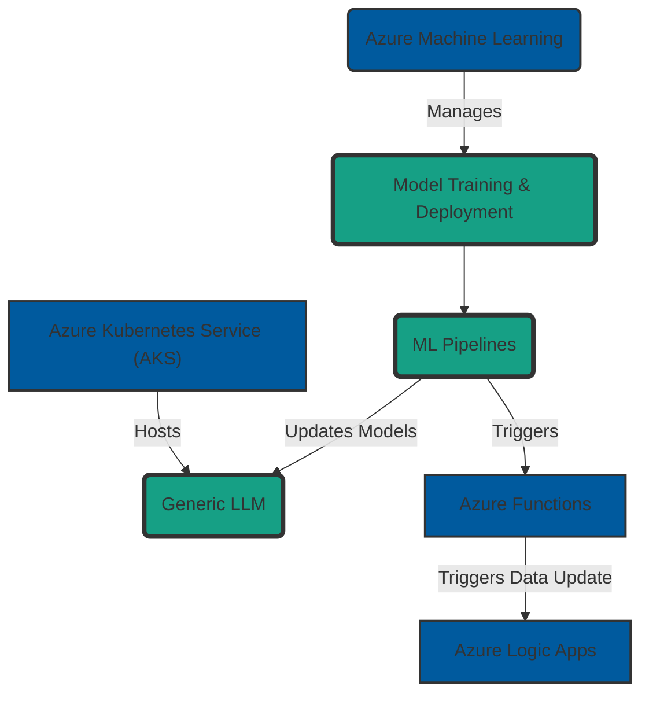
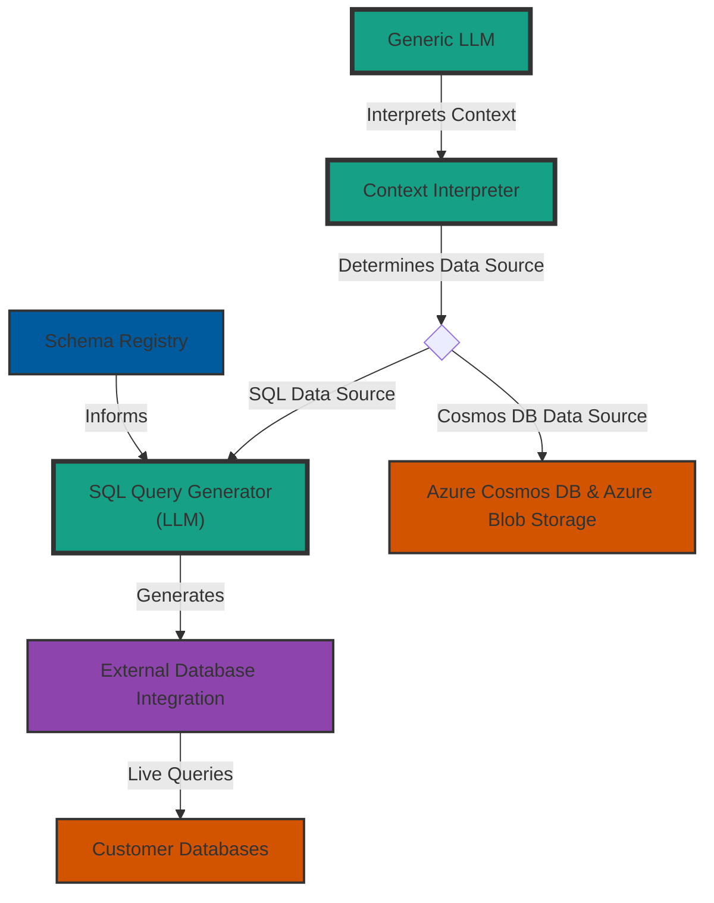
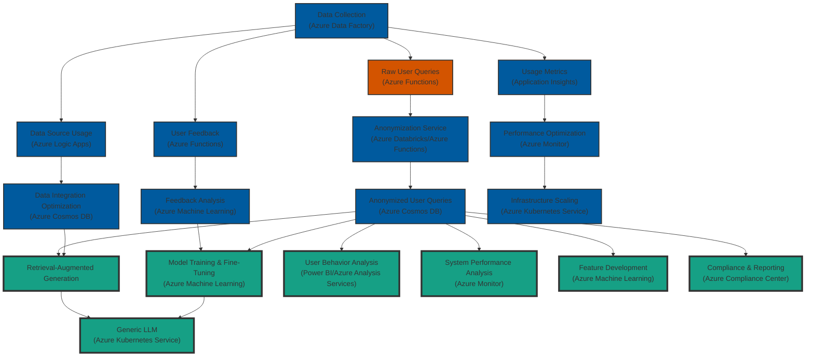
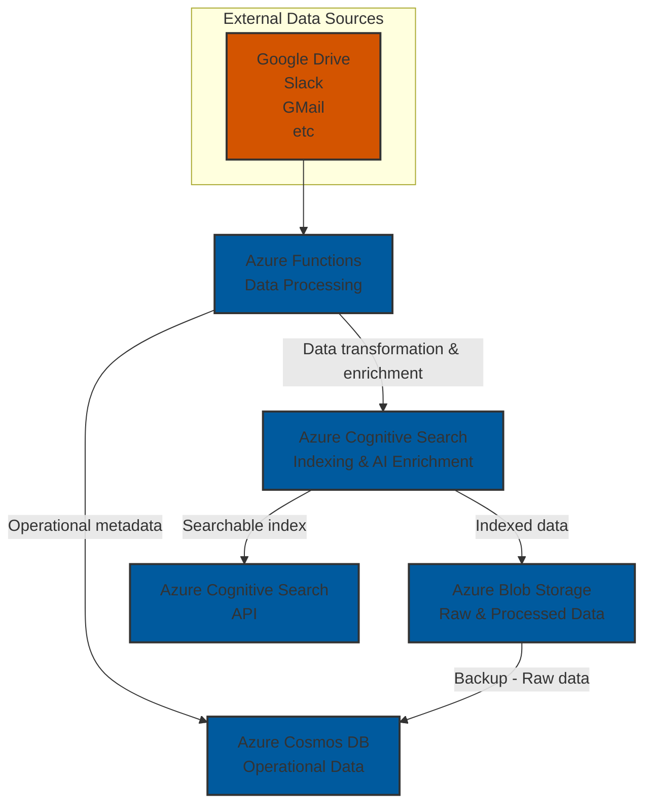
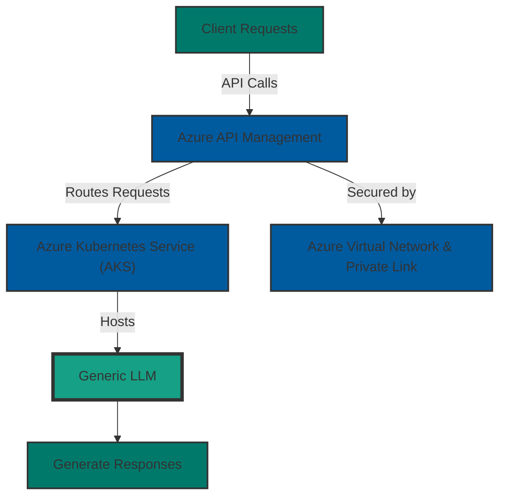
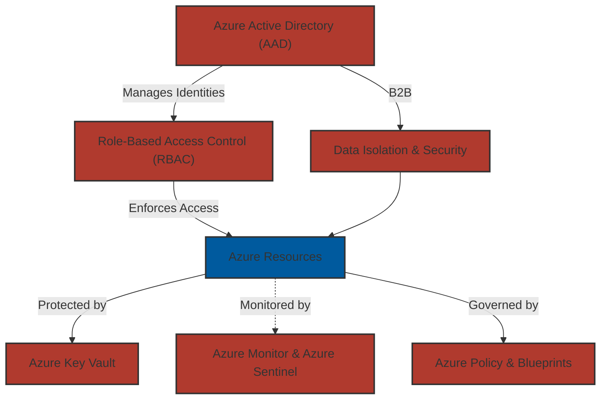
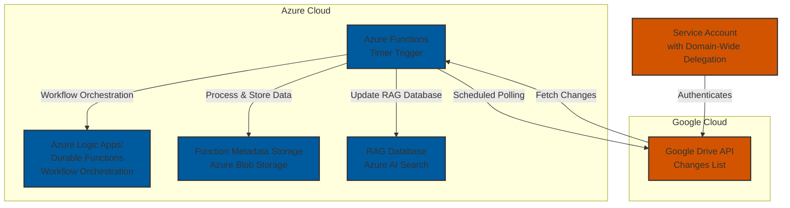

# Architecture

## Model
### Training/Updates

### Data Updates

### Data Retrieval

### Feedback Loops

### AI Database

### Client Requests

### Security

## External Integrations
### Google Drive

